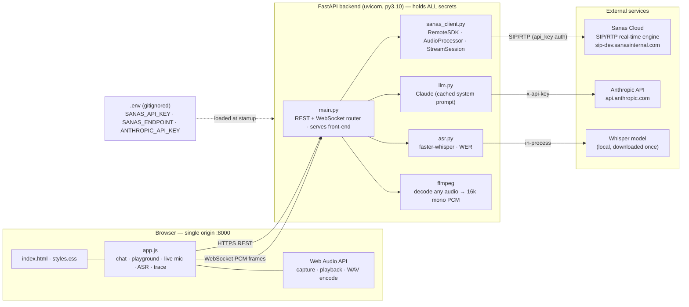
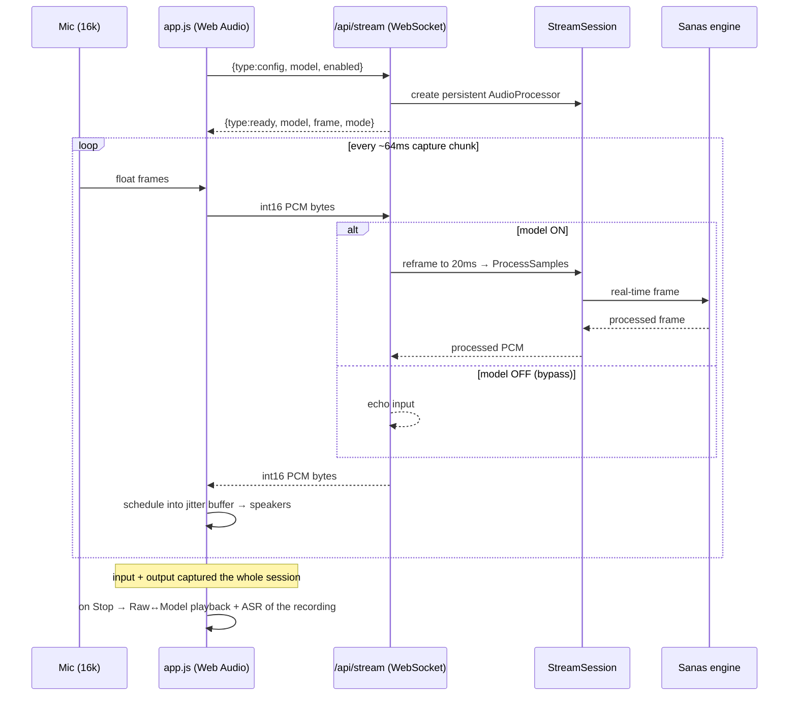
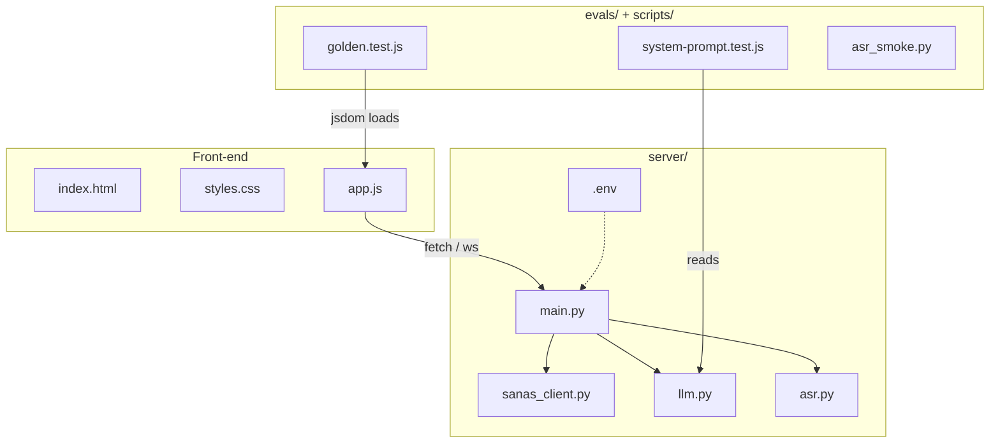

# Sani — Architecture & Documentation

**Sani** is a brand-accurate prototype of the Sanas.ai Speech-AI consultant: a marketing
page with an always-on chat concierge ("Sani"), a model **Playground**, **live mic
streaming** through the real Sanas engine, and developer/observability surfaces.

It is a thin single-page front-end backed by one FastAPI service. The backend is the
**only** place that holds secrets (Sanas SDK credentials, Anthropic key) and the only
code that talks to the native Sanas Remote SDK. The browser never sees a credential.

- **Live app:** the backend serves the front-end and the API on one origin (`http://127.0.0.1:8000`).
- **Stack:** vanilla JS + Web Audio (no framework) · FastAPI/uvicorn (Python 3.10) ·
  `sanas_remote_sdk` (native wheel) · Anthropic SDK (Claude) · faster-whisper (ASR).

---

## 1. High-level architecture



ASCII fallback:

```
                 ┌───────────────────────── Browser (one origin :8000) ─────────────────────────┐
                 │  index.html / styles.css   app.js (chat, playground, live, ASR, trace)        │
                 │                              └── Web Audio (capture / playback / WAV encode)   │
                 └───────────┬───────────────────────────────────┬───────────────────────────────┘
                   HTTPS REST │                      WebSocket PCM │ (live mic)
                              ▼                                    ▼
                 ┌───────────────────────── FastAPI backend (uvicorn, py3.10) ───────────────────┐
                 │  main.py  — REST + WS router, also serves the 3 front-end files               │
                 │     ├── sanas_client.py  ── RemoteSDK / AudioProcessor / StreamSession ───────────► Sanas Cloud (SIP/RTP)
                 │     ├── llm.py           ── Claude, cached system prompt ────────────────────────► api.anthropic.com
                 │     ├── asr.py           ── faster-whisper + WER (in-process) ──────► local Whisper model
                 │     └── ffmpeg           ── decode any upload → 16k mono PCM                    │
                 │  secrets: server/.env (gitignored) — never sent to the browser                │
                 └────────────────────────────────────────────────────────────────────────────────┘
```

### Why this shape
- **Native SDK is server-side only.** `sanas_remote_sdk` is a compiled wheel that speaks
  SIP/RTP; it cannot run in a browser. It also carries the account secret, which must
  never reach the client. So a backend is mandatory, and it is the single integration point.
- **Graceful degradation everywhere.** Each external dependency (Sanas SDK, Claude, Whisper)
  is optional at runtime. If one is unavailable the feature reports it via `/api/health`
  and the rest of the app keeps working (mock audio / rule-based chat / "ASR not enabled").

---

## 2. Components

| Component | File | Responsibility |
|---|---|---|
| **Front-end shell** | `index.html`, `styles.css` | Marketing surface + the Sani chat panel; brand palette, Sanas Toggle, Sound-Wave mark. |
| **Front-end app** | `app.js` | Rule engine (retrieval, persona, skeptic, guardrails), rich UI nodes (recommendation, audio showroom, ROI, code, 8-layer trace, **Playground**, **live mic**), Web-Audio capture/playback, ASR/chat clients. |
| **API + router** | `server/main.py` | All HTTP/WS endpoints; loads `.env`; serves only the 3 front-end files (no source/.env/vendor); ingress quality probe; clip-length cap. |
| **Sanas SDK client** | `server/sanas_client.py` | The only code touching `sanas_remote_sdk`. Batch `process()` (real-time-paced + drain) and `StreamSession` (persistent processor for live). Mock fallback when the SDK/creds are absent. |
| **Chat brain** | `server/llm.py` | Claude via the Anthropic SDK. Prompt-cached system prompt (KB + voice + guardrails) + per-persona block. Returns `None` to signal the client to fall back to the rule engine. |
| **ASR** | `server/asr.py` | faster-whisper transcription + a from-scratch word-level WER. Optional dependency. |
| **Golden evals** | `evals/` | Loads the real `app.js` engine under jsdom and asserts guardrails, persona routing, recommendations, voice rules; static invariants on the LLM system prompt. CI gate. |

---

## 3. API surface

| Method | Path | Purpose |
|---|---|---|
| `GET` | `/api/health` | SDK mode/auth, LLM + ASR availability, active processors, last error. |
| `POST` | `/api/chat` | One-shot Claude reply (`mode: llm` or `fallback`). |
| `POST` | `/api/chat/stream` | Token-by-token Claude reply (chunked); `X-San-Mode: llm\|fallback` header. |
| `GET` | `/api/models` | Model list + metadata + feature tabs (SE / NC real; Accent / Language flagged n/a). |
| `POST` | `/api/process` | Upload audio → ffmpeg decode → ingress probe → SDK `ProcessSamples` → WAV back. Timings/probe in `X-Sanas-*` headers; clip capped at `SAN_MAX_CLIP_S`. |
| `POST` | `/api/asr` | Transcribe before/after (+ optional clean reference) → recognition confidence and true WER delta. |
| `WS` | `/api/stream` | **Live mic.** Bidirectional int16 PCM frames through a persistent processor; JSON control (`model`, `enabled`); bypass echoes input. |
| `GET` | `/` , `/{index.html,app.js,styles.css}` | Serve the front-end (no-cache; all-list only). |

---

## 4. Key flows

### 4.1 Chat (streamed, Claude-grounded)

```mermaid
sequenceDiagram
  participant U as User
  participant APP as app.js (rule engine)
  participant API as /api/chat/stream
  participant LLM as llm.py
  participant C as Claude
  U->>APP: message
  APP->>APP: classify persona + skeptic; rule engine picks rich nodes
  alt conversational turn (no node / handoff / refusal)
    APP->>API: POST history + persona
    API->>LLM: chat_stream(...)
    LLM->>C: messages.stream (cached system prompt)
    C-->>LLM: token deltas
    LLM-->>API: deltas
    API-->>APP: chunked text (X-San-Mode: llm)
    APP-->>U: bubble fills live, then sources/markdown
  else node / refusal / no key
    APP-->>U: deterministic reply (rule engine)
  end
```
Guardrails, refusals, and the interactive components stay deterministic in `app.js`; only
open conversational prose is delegated to Claude (grounded by the same KB in the system prompt).

### 4.2 Upload → process (batch, real SDK)

```
Browser ──file──► POST /api/process?model=SE2.2
                    ├─ ffmpeg → mono 16k s16le PCM
                    ├─ trim to SAN_MAX_CLIP_S
                    ├─ ingress probe (SNR / clip / silence / VAD)
                    ├─ sanas_client.process()  → RemoteSDK AudioProcessor, fed at 20ms cadence + drain
                    └─ WAV out + X-Sanas-* headers (mode, model, snr, timings, truncated)
Browser ◄─ decode both sides → before/after player (Play/Stop) + measured trace + ASR
```

### 4.3 Live mic (real-time streaming)



Raw mic is routed through a zero-gain node (no feedback); only model output is audible.
The whole session (raw + output) is recorded (≤90s) and offered as a Raw↔Model playback on Stop.

### 4.4 ASR recognition comparison

```
before + after (+ optional clean reference) ──► POST /api/asr
   ffmpeg decode → faster-whisper transcribe each
   reference present?  yes → true WER(before)/WER(after) + delta
                       no  → Whisper recognition-confidence delta
```

---

## 5. Security & data handling
- **Credentials live only in `server/.env`** (gitignored): `SANAS_API_KEY`/account creds,
  `SANAS_ENDPOINT`, `ANTHROPIC_API_KEY`. Loaded at startup; a non-empty value in the
  environment wins, but `.env` overrides a *blank* env var (so a stray empty key can't mask it).
- **Static allow-list:** the server serves only `index.html`, `app.js`, `styles.css` —
  never backend source, `.env`, or `vendor/`.
- **Audio:** uploaded/clip audio is processed in-memory; the Sanas engine is Zero-Knowledge
  (no external storage during real-time processing).
- **Anthropic auth hardening:** a blank `ANTHROPIC_AUTH_TOKEN` is dropped before constructing
  the client (otherwise the SDK emits an illegal empty `Authorization: Bearer` header).

---

## 6. Configuration (`server/.env`)

| Var | Meaning |
|---|---|
| `SANAS_ENDPOINT` | SIP endpoint (e.g. `sip-dev.sanasinternal.com`). |
| `SANAS_API_KEY` | Developer-console key (preferred). Or `SANAS_ACCOUNT_ID` + `SANAS_ACCOUNT_SECRET`. |
| `SANAS_MODEL` | Default model (`SE2.2`). |
| `SANAS_FRAME_MS` / `SANAS_DRAIN_MS` | Frame cadence (20ms) / pipeline drain tail. |
| `SAN_MAX_CLIP_S` | Upload length cap (default 30s; real-time engine ≈ clip duration). |
| `ANTHROPIC_API_KEY` | Enables Claude chat; absent → rule-engine fallback. |
| `SAN_LLM_MODEL` | Chat model (`claude-sonnet-4-6` default; `claude-opus-4-8` for max quality). |

---

## 7. Models & capabilities

| Model (real SDK) | Feature | Sample rate |
|---|---|---|
| `SE2.2`, `SE2.1` | Speech Enhancement | 16 kHz |
| `VI_G_NC3.0`, `AGENTIC_VI_G_NC`, `AGENTIC_ST_NC` | Noise Cancellation | 16 kHz |
| `AGENTIC_VI_GT_NC` | Noise Cancellation (telephony) | 8 kHz |

Accent Translation and Language Translation are Sanas product capabilities **not exposed
as models in this SDK build** — the Playground shows them as tabs flagged `n/a` (honest,
not faked).

---

## 8. Run, test, deploy
- **Run (macOS native):** `cd server && .venv310/bin/uvicorn main:app --port 8000` → open `http://127.0.0.1:8000`.
  (Run in a normal terminal so the backend has outbound network for Claude.)
- **Golden evals:** `npm install && npm run eval` (16 checks; also CI via `.github/workflows/evals.yml`).
- **ASR smoke test:** `server/.venv310/bin/python scripts/asr_smoke.py [clip.wav] [--reference "…"] [--process]`.
- **Deploy (Linux):** `docker compose up --build` (Ubuntu 22.04 x86-64 image installs the SDK tarball).
- **Mock mode:** without the SDK/creds the backend boots in mock mode (clearly labelled by `/api/health`).

---

## 9. File map

```
san-consultant/
├── index.html · styles.css · app.js      # front-end (marketing + Sani consultant)
├── package.json                          # golden-eval runner (jsdom)
├── ARCHITECTURE.md · README.md
├── server/
│   ├── main.py                           # FastAPI: REST + /api/stream WS; serves front-end
│   ├── sanas_client.py                   # sanas_remote_sdk wrapper + StreamSession (the only SDK code)
│   ├── llm.py                            # Claude chat (cached system prompt)
│   ├── asr.py                            # faster-whisper + WER
│   ├── requirements.txt · .env.example · Dockerfile · docker-compose.yml
│   ├── .env  · .venv310/                 # secrets + py3.10 venv with the SDK wheel (gitignored)
├── evals/                                # golden.test.js · system-prompt.test.js · engine.js
├── scripts/                              # run_mac.sh · build_scenarios.sh · asr_smoke.py
├── assets/                               # curated before/after WAVs + raw/_voice.wav
└── .github/workflows/evals.yml           # CI gate
```

