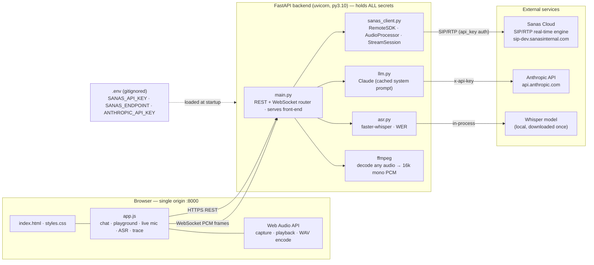
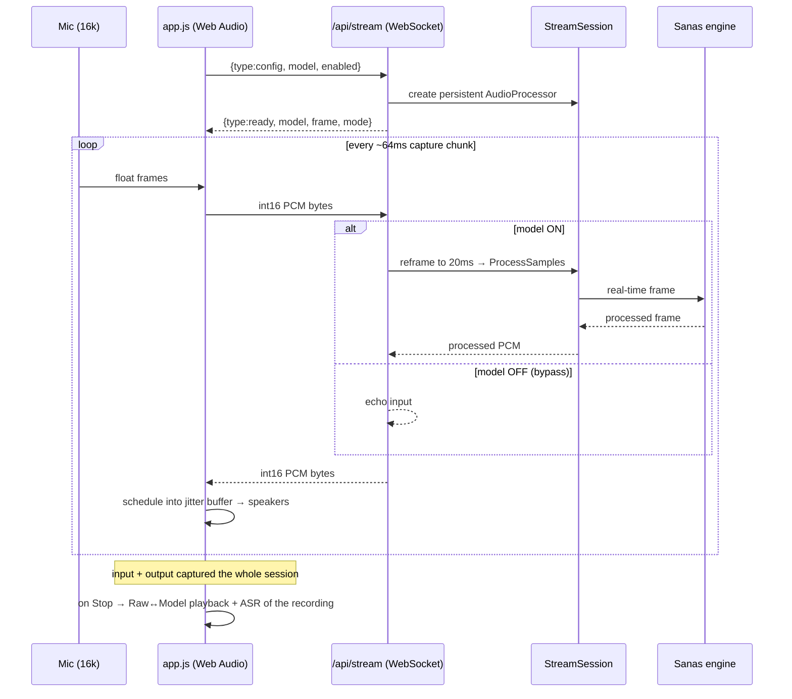
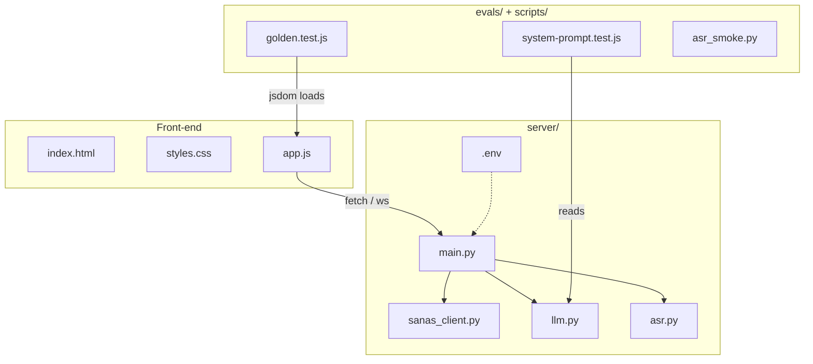

# Sanas.AI — Architecture & Documentation

**Sanas.AI** is a brand-accurate prototype of the Sanas.ai Speech-AI consultant: a marketing
page with an always-on chat concierge ("Sanas.AI"), a model **Playground**, **live mic
streaming** through the real Sanas engine, and developer/observability surfaces.

It is a thin single-page front-end backed by one FastAPI service. The backend is the
**only** place that holds secrets (Sanas SDK credentials, Anthropic key) and the only
code that talks to the native Sanas Remote SDK. The browser never sees a credential.

- **Live app:** the backend serves the front-end and the API on one origin (`http://127.0.0.1:8000`).
- **Stack:** vanilla JS + Web Audio (no framework) · FastAPI/uvicorn (Python 3.10) ·
  `sanas_remote_sdk` (native wheel) · Anthropic SDK (Claude) · faster-whisper (ASR).


---

## 1. High-level architecture


```mermaid
flowchart LR
  subgraph Browser["Browser — single origin :8000"]
    UI["index.html · styles.css"]
    APP["app.js<br/>chat · playground · live mic · ASR · trace"]
    WA["Web Audio API<br/>capture · playback · WAV encode"]
    UI --- APP --- WA
  end

  subgraph Backend["FastAPI backend (uvicorn, py3.10) — holds ALL secrets"]
    API["main.py<br/>REST + WebSocket router · serves front-end"]
    SC["sanas_client.py<br/>RemoteSDK · AudioProcessor · StreamSession"]
    LLM["llm.py<br/>Claude (cached system prompt)"]
    ASR["asr.py<br/>faster-whisper · WER"]
    FF["ffmpeg<br/>decode any audio → 16k mono PCM"]
    API --> SC
    API --> LLM
    API --> ASR
    API --> FF
  end

  subgraph External["External services"]
    SDKSVC["Sanas Cloud<br/>SIP/RTP real-time engine<br/>sip-dev.sanasinternal.com"]
    ANTH["Anthropic API<br/>api.anthropic.com"]
    WHIS["Whisper model<br/>(local, downloaded once)"]
  end

  APP -- "HTTPS REST" --> API
  APP -- "WebSocket PCM frames" --> API
  SC  -- "SIP/RTP (api_key auth)" --> SDKSVC
  LLM -- "x-api-key" --> ANTH
  ASR -- "in-process" --> WHIS

  ENV[".env (gitignored)<br/>SANAS_API_KEY · SANAS_ENDPOINT · ANTHROPIC_API_KEY"] -. loaded at startup .-> Backend
```

ASCII fallback:

```
                 ┌───────────────────────── Browser (one origin :8000) ─────────────────────────┐
                 │  index.html / styles.css   app.js (chat, playground, live, ASR, trace)        │
                 │                              └── Web Audio (capture / playback / WAV encode)   │
                 └───────────┬───────────────────────────────────┬───────────────────────────────┘
                   HTTPS REST │                      WebSocket PCM │ (live mic)
                              ▼                                    ▼
                 ┌───────────────────────── FastAPI backend (uvicorn, py3.10) ───────────────────┐
                 │  main.py  — REST + WS router, also serves the 3 front-end files               │
                 │     ├── sanas_client.py  ── RemoteSDK / AudioProcessor / StreamSession ───────────► Sanas Cloud (SIP/RTP)
                 │     ├── llm.py           ── Claude, cached system prompt ────────────────────────► api.anthropic.com
                 │     ├── asr.py           ── faster-whisper + WER (in-process) ──────► local Whisper model
                 │     └── ffmpeg           ── decode any upload → 16k mono PCM                    │
                 │  secrets: server/.env (gitignored) — never sent to the browser                │
                 └────────────────────────────────────────────────────────────────────────────────┘
```

### Why this shape
- **Native SDK is server-side only.** `sanas_remote_sdk` is a compiled wheel that speaks
  SIP/RTP; it cannot run in a browser. It also carries the account secret, which must
  never reach the client. So a backend is mandatory, and it is the single integration point.
- **Graceful degradation everywhere.** Each external dependency (Sanas SDK, Claude, Whisper)
  is optional at runtime. If one is unavailable the feature reports it via `/api/health`
  and the rest of the app keeps working (audio processing reports unavailable — no mock / rule-based chat / "ASR not enabled").

---

## 2. Components

| Component | File | Responsibility |
|---|---|---|
| **Front-end shell** | `index.html`, `styles.css` | Marketing surface + the Sanas.AI chat panel; brand palette, Sanas Toggle, Sound-Wave mark. |
| **Front-end app** | `app.js` | Rule engine (retrieval, **8-persona** classify/dropdown — Curious / Help / CX / Telco / Developer / Data-Scientist / IT-Security / **Partner** — plus an **industry** dropdown (Healthcare / Financial Services / Retail / Travel / **Telecom**), skeptic, guardrails), **inline-link rendering** of Claude's markdown citations, rich UI nodes (recommendation, audio showroom playing the **real sanas.ai clips**, ROI, code, 8-layer trace, **Playground**, **live mic**, uploaded-clip **model picker** + client-side **spectrogram** STFT), Web-Audio capture/playback, ASR/chat clients. |
| **API + router** | `server/main.py` | All HTTP/WS endpoints; loads `.env`; serves only the 3 front-end files (no source/.env/vendor); ingress quality probe; clip-length cap. |
| **Sanas SDK client** | `server/sanas_client.py` | The only code touching `sanas_remote_sdk`. Batch `process()` (real-time-paced + drain) and `StreamSession` (persistent processor for live). When the SDK/creds are absent, processing is unavailable (`process()` raises `SanasUnavailable`) — no mock. |
| **Chat brain** | `server/llm.py` | Claude via the Anthropic SDK. Prompt-cached system prompt (KB + voice + guardrails) + per-persona block. Formats retrieved context as either sanas.ai pages (inline-linked) or **uploaded documents** (cited by filename). Returns `None` to signal the client to fall back to the rule engine. |
| **Site retrieval** | `server/webindex.py` + `web_index.json` | Lexical (TF) top-k over the crawled sanas.ai/help.sanas.ai index; intent-biased `prefer=`. |
| **Document RAG** | `server/doc_index.py` + `rag_store.json` | Parses uploaded PDF/DOCX/TXT/MD, chunks (~2 kB), lexically indexes (same scoring as the site), **persists to disk**; `_retrieve()` in `main.py` merges doc hits ahead of site pages for grounding. |
| **ASR** | `server/asr.py` | faster-whisper transcription + a from-scratch word-level WER. Optional dependency. |
| **Analytics** | `server/analytics.py` + `events.jsonl` / `profiles.json` | First-party marketing capture: append-only event log + profile registry (first-touch UTM attribution, identify-on-form), chat-thread reconstruction, optional `SAN_EVENTS_WEBHOOK` realtime forwarding. Admin console: `admin.html`. |
| **Mailer** | `server/mailer.py` | SMTP sender for the "More Information / book a demo" flow. Creds in `.env`; degrades to a logged no-op when unset. |
| **Golden evals** | `evals/` | Loads the real `app.js` engine under jsdom and asserts guardrails, persona routing, recommendations, voice rules; static invariants on the LLM system prompt. CI gate. |

---

## 3. API surface

| Method | Path | Purpose |
|---|---|---|
| `GET` | `/api/health` | SDK mode/auth, LLM + ASR availability, active processors, last error. |
| `POST` | `/api/chat` | One-shot Claude reply (`mode: llm` or `fallback`). |
| `POST` | `/api/chat/stream` | Token-by-token Claude reply (chunked); `X-San-Mode: llm\|fallback` header. |
| `GET` | `/api/models` | Model list + metadata + feature tabs (SE / NC real; Accent / Language flagged n/a). |
| `POST` | `/api/process` | Upload audio → ffmpeg decode → ingress probe → SDK `ProcessSamples` → WAV back. Timings/probe in `X-Sanas-*` headers; clip capped at `SAN_MAX_CLIP_S`. |
| `POST` | `/api/asr` | Transcribe before/after (+ optional clean reference) → recognition confidence and true WER delta. |
| `GET` | `/api/admin/status` | Whether an admin password is configured. |
| `POST` | `/api/admin/login` | Admin login (`RAG_ADMIN_PASSWORD`) → in-memory bearer token (cleared on restart). |
| `POST` | `/api/admin/logout` | Invalidate the presented admin token. |
| `POST` | `/api/events` | **Marketing capture.** Batched first-party events from the front-end (page views + UTM, feature usage, full chat turns), tied to the visitor's durable profile id. |
| `GET` | `/api/analytics/summary` · `/profiles` · `/profile/{id}` · `/export` | **Marketing reporting (admin).** Totals, profile list, per-profile events + reconstructed chat threads, raw `events.jsonl` export. Requires `X-Admin-Token`. |
| `POST` | `/api/rag/upload` | **Document RAG (admin).** Upload PDF/DOCX/TXT/MD → parse + chunk + index (persisted) → `{doc_id, name, chunks, total_docs}`. Requires `X-Admin-Token`. |
| `GET` | `/api/rag/docs` | List indexed documents (admin; `X-Admin-Token`). |
| `POST` | `/api/rag/clear` | Wipe the document store (admin; `X-Admin-Token`). |
| `POST` | `/api/demo/book` | **Book a demo / More information.** Capture the lead → email it to `DEMO_NOTIFY_EMAIL` + a confirmation (with the booking link) to the contact via SMTP → return `BOOKING_URL`. |
| `GET` | `/api/demo/config` | Booking URL, resolved embeddable `embed_url` (the scheduler is shown inline in an iframe), and whether SMTP is configured. |
| `POST` | `/api/partner/apply` | **Partner application** (mirrors sanas.ai/partner-form): capture → email to the partnerships owner + confirmation to the applicant (SMTP, graceful no-op). |
| `WS` | `/api/stream` | **Live mic.** Bidirectional int16 PCM frames through a persistent processor; JSON control (`model`, `enabled`); bypass echoes input. |
| `GET` | `/` , `/{index.html,app.js,styles.css}` | Serve the front-end (no-cache; all-list only). |

---

## 4. Key flows

### 4.1 Chat (streamed, Claude-grounded)

```mermaid
sequenceDiagram
  participant U as User
  participant APP as app.js (rule engine)
  participant API as /api/chat/stream
  participant LLM as llm.py
  participant C as Claude
  U->>APP: message
  APP->>APP: classify persona + skeptic; rule engine picks rich nodes
  alt conversational turn (no node / handoff / refusal)
    APP->>API: POST history + persona
    API->>LLM: chat_stream(...)
    LLM->>C: messages.stream (cached system prompt)
    C-->>LLM: token deltas
    LLM-->>API: deltas
    API-->>APP: chunked text (X-San-Mode: llm)
    APP-->>U: bubble fills live, then sources/markdown
  else node / refusal / no key
    APP-->>U: deterministic reply (rule engine)
  end
```
Guardrails, refusals, and the interactive components stay deterministic in `app.js`; only
open conversational prose is delegated to Claude (grounded by the same KB in the system prompt).

### 4.2 Upload → process (batch, real SDK)

```
Browser ──file──► POST /api/process?model=SE2.2
                    ├─ ffmpeg → mono 16k s16le PCM
                    ├─ trim to SAN_MAX_CLIP_S
                    ├─ ingress probe (SNR / clip / silence / VAD)
                    ├─ sanas_client.process()  → RemoteSDK AudioProcessor, fed at 20ms cadence + drain
                    └─ WAV out + X-Sanas-* headers (mode, model, snr, timings, truncated)
Browser ◄─ decode both sides → before/after player (Play/Stop) + spectrogram (client STFT)
            + measured trace + ASR
            └─ "Analyze against" model picker: re-POST the original clip with ?model=NAME,
               swap proc audio + redraw waveform / spectrogram / ASR (no re-upload)
```

### 4.3 Live mic (real-time streaming)


```mermaid
sequenceDiagram
  participant Mic as Mic (16k)
  participant APP as app.js (Web Audio)
  participant WS as /api/stream (WebSocket)
  participant SS as StreamSession
  participant E as Sanas engine
  APP->>WS: {type:config, model, enabled}
  WS->>SS: create persistent AudioProcessor
  WS-->>APP: {type:ready, model, frame, mode}
  loop every ~64ms capture chunk
    Mic->>APP: float frames
    APP->>WS: int16 PCM bytes
    alt model ON
      WS->>SS: reframe to 20ms → ProcessSamples
      SS->>E: real-time frame
      E-->>SS: processed frame
      SS-->>WS: processed PCM
    else model OFF (bypass)
      WS-->>WS: echo input
    end
    WS-->>APP: int16 PCM bytes
    APP->>APP: schedule into jitter buffer → speakers
  end
  Note over APP: input + output captured the whole session
  APP->>APP: on Stop → Raw↔Model playback + ASR of the recording
```

Raw mic is routed through a zero-gain node (no feedback); only model output is audible.
The whole session (raw + output) is recorded (≤90s) and offered as a Raw↔Model playback on Stop.

### 4.4 ASR recognition comparison

```
before + after (+ optional clean reference) ──► POST /api/asr
   ffmpeg decode → faster-whisper transcribe each
   reference present?  yes → true WER(before)/WER(after) + delta
                       no  → Whisper recognition-confidence delta
```

---

## 5. Security & data handling
- **Credentials live only in `server/.env`** (gitignored): `SANAS_API_KEY`/account creds,
  `SANAS_ENDPOINT`, `ANTHROPIC_API_KEY`. Loaded at startup; a non-empty value in the
  environment wins, but `.env` overrides a *blank* env var (so a stray empty key can't mask it).
- **Static allow-list:** the server serves only `index.html`, `app.js`, `styles.css`,
  `config.js`, and the admin console `admin.html` — never backend source, `.env`, or `vendor/`.
- **Audio:** uploaded/clip audio is processed in-memory; the Sanas engine is Zero-Knowledge
  (no external storage during real-time processing).
- **First-party analytics store:** marketing events + identified visitor profiles (incl. lead
  email/name and chat transcripts) persist under `SAN_DATA_DIR` (`events.jsonl` / `profiles.json`).
  Reads are admin-gated (`/api/analytics/*`); ingestion (`POST /api/events`) is public but
  rate-limited and byte-capped. Treat that directory as PII — see DEPLOY_AWS.md for retention.
- **Anthropic auth hardening:** a blank `ANTHROPIC_AUTH_TOKEN` is dropped before constructing
  the client (otherwise the SDK emits an illegal empty `Authorization: Bearer` header).

---

## 6. Configuration (`server/.env`)

| Var | Meaning |
|---|---|
| `SANAS_ENDPOINT` | SIP endpoint (e.g. `sip-dev.sanasinternal.com`). |
| `SANAS_API_KEY` | Developer-console key (preferred). Or `SANAS_ACCOUNT_ID` + `SANAS_ACCOUNT_SECRET`. |
| `SANAS_MODEL` | Default model (`SE2.2`). |
| `SANAS_FRAME_MS` / `SANAS_DRAIN_MS` | Frame cadence (20ms) / pipeline drain tail. |
| `SAN_MAX_CLIP_S` | Upload length cap (default 30s; real-time engine ≈ clip duration). |
| `ANTHROPIC_API_KEY` | Enables Claude chat; absent → rule-engine fallback. |
| `SAN_LLM_MODEL` | Chat model (`claude-sonnet-4-6` default; `claude-opus-4-8` for max quality). |
| `SAN_CACHE` / `SAN_CACHE_TTL` / `SAN_REDIS_URL` | Response cache (Claude reply reuse): on by default, in-process; set `SAN_REDIS_URL` to share it via ElastiCache/Redis. |
| `SAN_RATE_LIMIT` / `SAN_RATE_WINDOW` | Per-IP rate limit on the expensive endpoints (default 60/60s; `0`/`off` disables). |
| `SAN_EVENTS_RATE_LIMIT` | Separate per-IP limit for `POST /api/events` (default 240/window) so analytics flushes never starve chat. |
| `SAN_EVENTS_WEBHOOK` | Optional: POST every accepted analytics batch to a CDP / HTTP collector (Segment, RudderStack, …) for realtime marketing fan-out. Unset = store-only. |
| `SAN_MAX_PROFILES` | Cap on stored visitor profiles (default 50000; least-recently-seen evicted) to bound the registry against bot churn. |
| `RAG_ADMIN_PASSWORD` | Enables the `/admin.html` console (knowledge-base upload + marketing analytics). Unset = admin locked. |

> **Cost & scale:** prompt caching (two breakpoints), the response cache, and the per-IP
> rate limit keep the Claude bill down; the in-process defaults swap to ElastiCache/Redis for
> multi-instance. Full AWS deployment + the IT service/access list live in [DEPLOY_AWS.md](DEPLOY_AWS.md).

---

## 7. Models & capabilities

| Model (real SDK) | Feature | Sample rate |
|---|---|---|
| `SE2.2`, `SE2.1` | Speech Enhancement | 16 kHz |
| `VI_G_NC3.0`, `AGENTIC_VI_G_NC`, `AGENTIC_ST_NC` | Noise Cancellation | 16 kHz |
| `AGENTIC_VI_GT_NC` | Noise Cancellation (telephony) | 8 kHz |

Accent Translation and Language Translation are Sanas product capabilities **not exposed
as models in this SDK build** — the Playground shows them as tabs flagged `n/a` (honest,
not faked).

---

## 8. Run, test, deploy
- **Run (macOS native):** `cd server && .venv310/bin/uvicorn main:app --port 8000` → open `http://127.0.0.1:8000`.
  (Run in a normal terminal so the backend has outbound network for Claude.)
- **Golden evals:** `npm install && npm run eval` (16 checks; also CI via `.github/workflows/evals.yml`).
- **ASR smoke test:** `server/.venv310/bin/python scripts/asr_smoke.py [clip.wav] [--reference "…"] [--process]`.
- **Deploy (Linux):** `docker compose up --build` (Ubuntu 22.04 x86-64 image installs the SDK tarball).
- **Deploy (AWS):** Amplify (front-end) + a single x86-64 EC2 running this Compose stack behind Caddy; ElastiCache/SES/Secrets Manager are the production add-ons. Full guide + the AWS service/access list for IT: [DEPLOY_AWS.md](DEPLOY_AWS.md).
- **No SDK:** without the SDK/creds, audio processing is unavailable — `/api/health` reports `mode:"unavailable"` and `/api/process` returns 503. There is no mock processing.

---

## 9. File map

```
san-consultant/
├── index.html · styles.css · app.js      # front-end (marketing + Sanas.AI consultant)
├── package.json                          # golden-eval runner (jsdom)
├── ARCHITECTURE.md · README.md
├── server/
│   ├── main.py                           # FastAPI: REST + /api/stream WS; serves front-end
│   ├── sanas_client.py                   # sanas_remote_sdk wrapper + StreamSession (the only SDK code)
│   ├── llm.py                            # Claude chat (cached system prompt)
│   ├── asr.py                            # faster-whisper + WER
│   ├── requirements.txt · .env.example · Dockerfile · docker-compose.yml
│   ├── .env  · .venv310/                 # secrets + py3.10 venv with the SDK wheel (gitignored)
├── evals/                                # golden.test.js · system-prompt.test.js · engine.js
├── scripts/                              # run_mac.sh · build_scenarios.sh · asr_smoke.py
├── assets/                               # curated before/after WAVs + raw/_voice.wav
└── .github/workflows/evals.yml           # CI gate
```

```mermaid
graph TD
  subgraph fe["Front-end"]
    H[index.html]; S[styles.css]; A[app.js]
  end
  subgraph be["server/"]
    M[main.py]; SCp[sanas_client.py]; L[llm.py]; AS[asr.py]; ENV[.env]
  end
  subgraph qa["evals/ + scripts/"]
    G[golden.test.js]; SP[system-prompt.test.js]; SM[asr_smoke.py]
  end
  A -->|fetch / ws| M
  M --> SCp & L & AS
  ENV -.-> M
  G -->|jsdom loads| A
  SP -->|reads| L
```

---

## Addendum — grounded citations (sanas.ai index)

### Grounded citations (`server/webindex.py` + `scripts/index_site.py`)
`scripts/index_site.py` crawls **sanas.ai** (product/industry/dev pages, the **`/science`
articles**, and blog & news posts) **and the help center `help.sanas.ai`** (every article
in its Document360 `llms.txt` — install/configure/integrate/troubleshoot/portal docs) into
`server/web_index.json` (~220 pages). On each chat turn the backend retrieves the
top-matching pages and passes them to Claude as grounding context, instructing it to
**weave inline markdown links** (`[anchor](url)`) to the pages it uses; `app.js`'s
markdown renderer turns those (and bare URLs) into clickable `<a target="_blank">`, and
the same pages also render as **source chips** under the answer.

Retrieval is **intent-biased**: `webindex.search(query, prefer=…)` boosts a section.
The **Data Scientist** persona passes `prefer="/science"` (grounds answers in the Sanas
science write-ups — 8→16 kHz upscaling, VAD, ASR-optimized NC). The **Help** persona and
**support/how-to questions** (detected by keywords — install, configure, integrate,
troubleshoot, reset, audio, dialer, …) pass `prefer="help.sanas.ai"`, so Sanas.AI answers
from and links to the real help docs. Existing-customer/support intents ("I'm an existing
customer", "open a ticket", "contact support") instead render a **Sanas Support Portal card**
that embeds and links `support.sanas.ai/support/home`. The audio showroom's before/after clips are the **real sanas.ai demo audio**
streamed from the Sanas media CDN (synth fallback if unreachable).

```
sanas.ai ──index_site.py──▶ web_index.json ──webindex.search(query, prefer)──▶ top pages
   /api/chat[/stream]:  llm.chat(..., context=pages)  +  X-San-Sources header → link chips
   persona=data_scientist → prefer="/science" → science articles float to the top
```

### Document RAG (`server/doc_index.py`)
**Upload is admin-gated** (`require_admin` dependency on `/api/rag/{upload,docs,clear}`):
`RAG_ADMIN_PASSWORD` in `.env` enables the login on the dedicated admin console
(`/admin.html`) that mints an in-memory bearer token sent as `X-Admin-Token`; the chat app
itself has no admin login or upload path. Retrieval over already-indexed docs is **not** gated — every visitor's chat turn
can ground in them. An admin uploads a file (`POST /api/rag/upload`); `doc_index.extract_text()` parses it
(pypdf / python-docx / plain decode + HTML strip), `_chunk()` splits it into ~2 kB blocks
on paragraph/sentence boundaries, and each chunk is lexically indexed with the **same
term-frequency scoring as the site** so the two result sets are directly comparable. The
store is written to `server/rag_store.json` and **shared across sessions** (survives
restarts; git-ignored as it may hold customer content). `main.py`'s `_retrieve()` runs on
every chat turn and **merges** uploaded-doc hits (kind `doc`) ahead of site pages (kind
`web`); `llm.py` formats docs as the user's priority material (cited by filename, no URL)
and the UI shows them as non-link **"from your documents"** chips. A near-zero match is
dropped (`min_score`) so an irrelevant doc isn't forced into context.

```
upload ─► doc_index.ingest(parse→chunk→index) ─► rag_store.json (disk, cross-session)
/api/chat[/stream]:  _retrieve() = doc_index.search(q) + webindex.search(q)  ─►  llm.chat(context=merged)
```

### Industry verticals + customer stories (`app.js` + `main.py`)
The industry dropdown (Healthcare / Financial Services / Retail / Travel / Telecom) sets a
vertical that (a) posts a tailored line linking the industry's sanas.ai page, (b) adds a
**"Customer stories" tag** to the bottom suggestions — clicking it renders a card of the real
`sanas.ai/customer-stories/<slug>` case studies for that vertical — and (c) rides along as
`industry` on `/api/chat`. Server-side, `_retrieve()`
**pins** the industry landing page + its customer story into the grounding context (via
`webindex.by_url` and a curated `_INDUSTRY_STORIES` map) so term-matching can't drop them, and
`llm.py` is told the vertical to frame examples/ROI. Telecom has no landing page, so it's
framed via telephony/NC and pins only its story.

### Persona default & deep-links (`app.js`)
Sanas.AI **defaults to "Just looking"** — opening the panel does not auto-switch the persona
from the in-view section. Persona changes only via the dropdown, typed-intent
classification, or an explicit `?persona=<key>` deep link (which also primes the matching
ROI model). The dropdown pick always wins; `?open=` opens straight to a view.

### File-map additions
```
server/webindex.py        # lexical retrieval over the indexed site
server/web_index.json     # indexed sanas.ai content (public; regenerate with the script)
server/doc_index.py       # document RAG: parse/chunk/index uploaded PDF/DOCX/TXT/MD
server/rag_store.json     # persisted uploaded-doc store (runtime data; git-ignored)
scripts/index_site.py     # crawler → web_index.json
```
