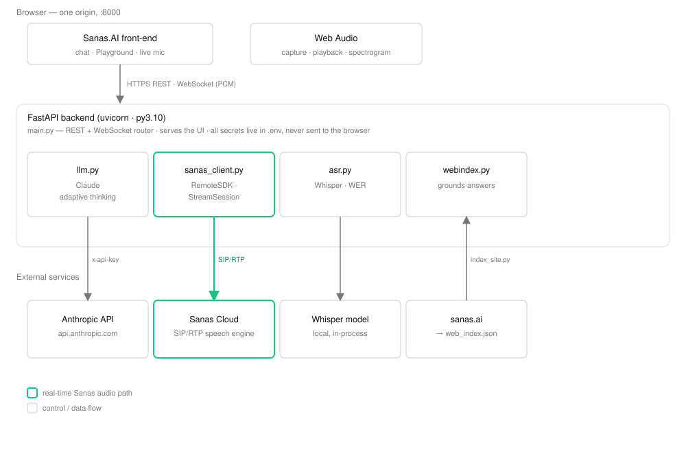
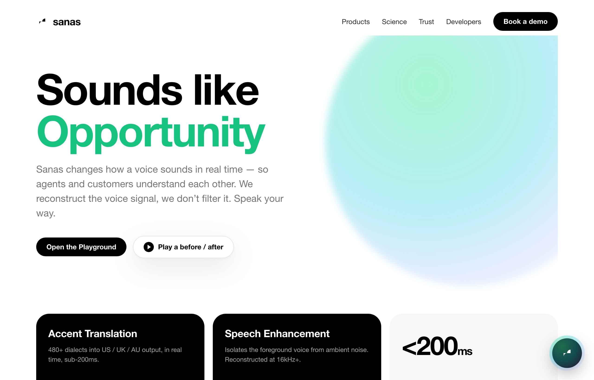
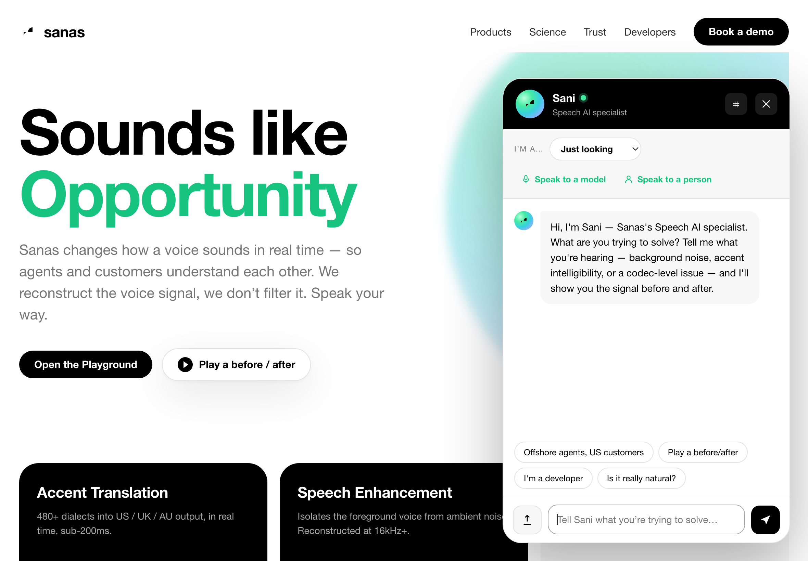
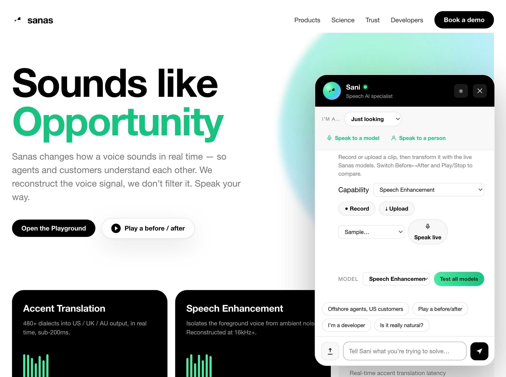
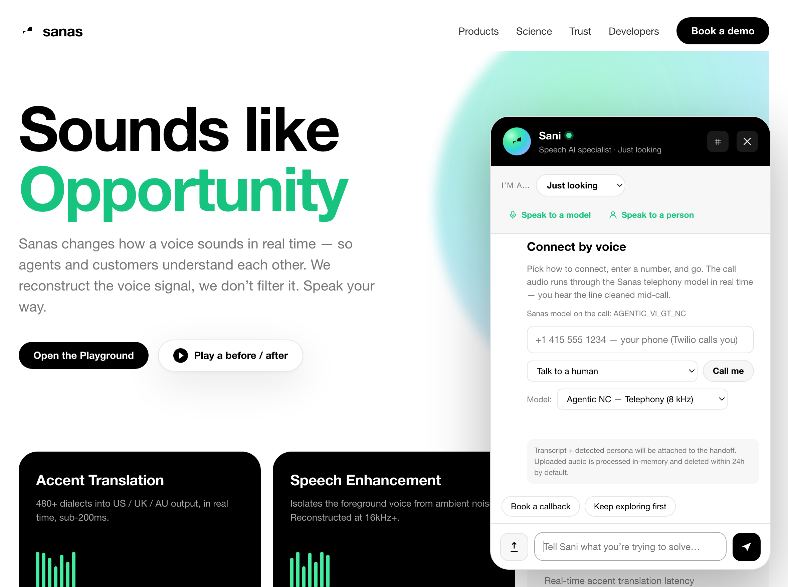

# Sani — the Sanas.ai Speech AI Consultant (MVP prototype)

A working, brand-accurate front-end prototype of **Sani**, the always-on speech-AI
consultant specified in *"The Sanas.ai Speech AI Consultant — Merged v1.0"*.

This build implements **Phase 1 (MVP)**: trusted education, a recommendation engine,
persona-aware routing, developer tooling, and self-observability — plus a **real
Sanas SDK integration** for live audio processing on uploaded clips.



> 📐 **Architecture & diagrams:** see [ARCHITECTURE.md](ARCHITECTURE.md) for the system
> diagram, component map, API surface, and the chat / upload / live-mic / ASR flows.

> 🔒 **Secret guard:** this repo ships a pre-commit hook that blocks commits adding API
> keys or a `.env` file. Enable it once per clone: `git config core.hooksPath .githooks`
> (real secrets stay in the gitignored `server/.env`). Override a false positive with
> `git commit --no-verify`.

## Screenshots

| | |
|---|---|
|  |  |
| **Landing** — the brand-accurate marketing surface | **Sani** — persona dropdown, typed opening, suggestions |
|  |  |
| **Playground** — capability + model dropdowns, record/upload, test-all | **Connect by voice** — one field, action dropdown, model picker |

> Tip: deep-link straight to a view with `?open=chat`, `?open=playground`, or `?open=connect`.

## Two ways to run

### A. Front-end only (curated demos, no SDK)
```bash
python3 -m http.server 4173 --directory .
# open http://localhost:4173
```
The curated showroom plays the **real before/after demo clips from sanas.ai**
(Accent Translation / Ambient Noise / Background Voices), streamed from the Sanas
media CDN, with Web-Audio synthesis as an offline fallback. Clip upload will show a
graceful "backend offline" fallback.

### B. With the real Sanas SDK (live processing on uploaded clips)
The Sanas Remote SDK (`sanas_remote_sdk`) is a native, platform-specific Python
package. It runs in a small backend that holds your credentials — the browser never
sees them. Pick the path for your platform:

**macOS / Apple Silicon (native — verified working):**
```bash
cp server/.env.example server/.env     # add SANAS_API_KEY (or account creds) + SANAS_ENDPOINT
./scripts/run_mac.sh /path/to/sanas_remote_sdk_darwin-arm64_<ver>/   # wheel folder or .whl
# backend on http://localhost:8080 ; serve the front-end with `python3 -m http.server 4173`
# (or set window.SAN_API_BASE to the backend origin)
```
`run_mac.sh` creates a Python 3.10 venv, installs the wheel + deps, and starts the
server (creds auto-loaded from `server/.env`).

**Linux deploy (Docker):**
```bash
cp server/.env.example server/.env
cp sanas_remote_sdk_linux_x86-64_<ver>.tar.gz server/vendor/
docker compose up --build           # → http://localhost:8000 (front-end + /api together)
```

Without the SDK the backend boots in **mock mode** (a stand-in cleanup, clearly
labelled by `/api/health` and in the UI) so the whole UX still works.

> **Auth:** `SANAS_API_KEY` (developer-console key, e.g. `sk_…`) is preferred and takes
> precedence; account-based `SANAS_ACCOUNT_ID` + `SANAS_ACCOUNT_SECRET` is the fallback.
>
> **Real-time engine:** the SDK is a live RTP pipeline — it emits processed audio at
> real-time rate, so the backend feeds frames on a 20ms cadence. Processing a clip
> takes roughly its own duration in wall-clock (an 8s clip ≈ 8–10s). This is the
> genuine engine behavior, not a simulation.

## What's here

| File | Purpose |
|------|---------|
| `index.html` / `styles.css` / `app.js` | The Sani front-end (marketing surface + chat consultant) |
| `server/main.py` | FastAPI orchestrator: `/api/process`, `/api/chat`, `/api/health`, `/api/models`, `/api/rag/*`, `/api/demo/*`; serves the front-end |
| `server/mailer.py` | Tiny SMTP sender for the "More Information / book a demo" flow (creds in `.env`; no-ops gracefully when unset) |
| `server/sanas_client.py` | The only code that talks to `sanas_remote_sdk` (RemoteSDK → AudioProcessor → ProcessSamples), with a mock fallback |
| `server/llm.py` | Sani's conversational brain — Claude via the Anthropic SDK (cached system prompt + per-persona register); falls back to the rule engine with no key |
| `server/twilio_routes.py` | Optional voice layer: IVR, human handoff, dial-in **in-path bridge**, DTMF model switching (see [TWILIO_SETUP.md](TWILIO_SETUP.md)) |
| `server/webindex.py` + `server/web_index.json` | Lexical retrieval over the indexed sanas.ai content (incl. `/science`) that grounds chat answers and supplies citations |
| `server/doc_index.py` + `server/rag_store.json` | **Document RAG** — parses uploaded PDF/DOCX/TXT/MD, chunks + lexically indexes them (persisted to disk), and grounds chat answers in the user's own material (`rag_store.json` is git-ignored runtime data) |
| `server/asr.py` | faster-whisper transcription + from-scratch word-level WER (optional dependency) |
| `scripts/index_site.py` | Crawls sanas.ai (product / science / blog) → `web_index.json` |
| `server/Dockerfile` + `docker-compose.yml` | Ubuntu 22.04 x86-64 image that installs your SDK tarball |
| `server/.env.example` | Credential template (real `.env` is git-ignored) |
| `scripts/run_mac.sh` | Native macOS runner — venv + wheel install + start the real-SDK backend |
| `scripts/build_scenarios.sh` | Generates the curated before/after audio (runs clips through the SDK backend) |
| `assets/*.wav` | Curated showroom audio — real-voice bed + noise → processed by the real engine |

## Claude-powered chat

Sani's prose is generated by Claude when `ANTHROPIC_API_KEY` is set in `server/.env`;
otherwise the deterministic rule engine answers (the UI is identical either way).

- **Streamed token-by-token** — conversational replies stream into the chat bubble as
  they generate (`/api/chat/stream`); the bubble fills live, then finalizes with
  markdown + source pills.
- **What Claude handles** — open Q&A, the Speech-Science explanations, and grounded
  conversation. The interactive components (recommendation cards, audio showroom, ROI,
  code, traces) and the safety refusals stay deterministic, so they're always crisp.
- **Grounding & guardrails** — `server/llm.py` puts the full knowledge base, the §5
  voice principles, and the §7.7 refusal rules in a **prompt-cached** system prompt,
  with a small per-persona block for register. No emoji, no superlatives, calibrated
  confidence — enforced in the prompt.
- **Model** — `SAN_LLM_MODEL` (default `claude-sonnet-4-6`; set `claude-opus-4-8` for
  max quality). Calls are resilient: any API error falls back to the rule engine.

## Curated audio (the Audio Showroom)

The three curated scenarios play the **actual before/after demo clips from
sanas.ai**, streamed directly from the Sanas media CDN (CORS-open, range-enabled, so
the browser decodes them itself — no files shipped, always the real thing):

| Scenario | Real clip | Product line |
|---|---|---|
| **Accent Translation** | Gabriel Rivera — degraded → AT (the homepage hero) | Accent Translation |
| **Ambient Noise** | Rain OFF → ON | Speech Enhancement |
| **Background Voices & Music** | Music-background OFF → ON | Speech Enhancement |

If the CDN is unreachable, the toggle falls back to live Web-Audio synthesis so the
mechanic still demonstrates. The Playground's **"Sample…"** selector feeds the real
degraded clip straight into the SDK for live processing. (`scripts/build_scenarios.sh`
+ `assets/*.wav` remain as an optional local-override path.)

## Sanas SDK integration (the live audio path)

Per the [developer docs](https://developer.sanas.ai/Docs/Getting-Started/Quick-Start):

- **Auth** — `InitParams.remoteEndpoint` + either `apiKey` (preferred) or `accountId` + `accountSecret` — all server-side env vars.
- **Models** — Speech Enhancement (`SE2.2` default), `SE2.1`, and noise-cancellation
  models (`VI_G_NC3.0`, `AGENTIC_*`). The public SDK has no "Accent Translation"
  model, so the live transformation wired here is **Speech Enhancement**; the curated
  Accent-Translation demo remains illustrative.
- **Flow** — a user uploads a clip → `POST /api/process` → ffmpeg decodes to mono
  16kHz PCM → the **ingress quality probe** (SNR / clip / silence / VAD) runs → the
  SDK's `ProcessSamples()` processes it → a clean WAV streams back, with timings and
  the probe readout in `X-Sanas-*` headers. The chat then plays a real before/after.
- **Security** — credentials never reach the browser; the backend serves only the
  three front-end files (source, `.env`, and `vendor/` are not exposed).

## Uploaded-clip analysis (model picker + spectrogram)

When you upload a clip in chat, the result is an interactive analysis card, not just a
player:

- **Model picker** — an **"Analyze against"** dropdown lists every Sanas model
  (`/api/models`) and defaults to the one that processed the clip. Switching it
  re-runs the *same* original audio through `POST /api/process?model=NAME` and swaps in
  the new output across the waveform, spectrogram, Before↔After playback, and the
  ASR/WER row. A failed model keeps the previous result and says so.
- **Spectrogram** — a client-side STFT (compact radix-2 FFT, 512-pt Hann window,
  256 hop) renders a log-magnitude frequency-over-time heat map, and follows the
  Before↔After toggle so you can see the spectrum the model reconstructs. No backend
  or extra deps — it decodes and analyzes in the browser.

## Grounded answers + sanas.ai citations

`scripts/index_site.py` crawls **sanas.ai** — product, industry, developer, and the
**`/science` articles** plus blog/news posts — **and the help center `help.sanas.ai`**
(every article in its Document360 `llms.txt`) into `server/web_index.json` (~220 pages).
On every chat turn the backend retrieves the top-matching pages (`server/webindex.py`),
passes them to Claude as grounding context. Sani **weaves inline links to the relevant
pages directly into its reply** (markdown `[anchor](url)` on the words it describes — and
bare URLs are auto-linked too), and the same pages also appear as **clickable source
chips** under the answer. Retrieval is intent-biased: the **Help** persona and any
**support/how-to question** (install, configure, integrate, troubleshoot, reset password,
…) prefer the help center (`prefer="help.sanas.ai"`); the **Data Scientist** persona
prefers the science articles (`prefer="/science"`). Re-index anytime:

```bash
server/.venv310/bin/python scripts/index_site.py   # refreshes web_index.json (public content)
```

## Document RAG — ground answers in your own files

Beyond the sanas.ai site, Sani can answer from **unstructured documents you upload**.
The document button in the composer (next to the audio-clip upload) accepts **PDF,
DOCX, TXT, and Markdown**; the backend parses the text (pypdf / python-docx / plain
decode), splits it into ~2 kB chunks, and indexes them with the **same lexical scoring
as the site index** — no embeddings service, no per-request cost.

- **`POST /api/rag/upload`** ingests a file → `{doc_id, name, chunks, total_docs}`.
  **`GET /api/rag/docs`** lists what's indexed; **`POST /api/rag/clear`** wipes it.
- On every chat turn the backend retrieves from **both corpora** (`_retrieve()` merges
  uploaded-doc hits ahead of sanas.ai pages) and labels each source `kind: "doc" | "web"`.
  Claude is told the documents are the user's own priority material, refers to them by
  filename, and won't invent a URL for them; site pages still get inline markdown links.
  Doc sources render as **"From your documents"** chips (not links) under the answer.
- **Persistence** — the store is written to `server/rag_store.json` and **shared across
  sessions**, so uploads survive a backend restart. It's git-ignored (may hold customer
  content). A scanned/image-only PDF (no extractable text) is reported back, not crashed on.
- **Honesty** — a near-zero lexical match is dropped (`min_score`), so an irrelevant
  document doesn't get forced into the context; if the docs don't answer the question,
  Sani says so rather than fabricating a fit.

## Page-context awareness — Sani opens in character

Which marketing page/section the visitor is on **pre-selects the persona and the first
message**. Detection priority: a `?persona=<key>` query param (explicit share link) →
the section currently in view (an `IntersectionObserver` over `[data-persona]` sections:
Products → CX, Science → Data Scientist, Trust → IT/Security) → the URL `#hash`
(incl. `#docs` → Developer) → the `help.` host → otherwise *Just looking*. The chosen
persona drives the dropdown, the header register, the tailored opening line and starter
suggestions, and **primes the matching ROI model** (Telco → churn/ARPU, everyone else →
contact-center). A user's explicit dropdown choice always wins.

## More Information — book a demo (intake → email → calendar)

The **More Information** button in the persona bar (next to *Test a model* and *Speak
live*) runs a booking flow that mirrors [sanas.ai/book-demo](https://www.sanas.ai/book-demo):

1. **Intake** — a form collects name, work email, company, job title, phone, company
   size, and what they're trying to solve (`POST /api/demo/book`).
2. **Email** — the backend emails the lead to `DEMO_NOTIFY_EMAIL`
   (default `chris.featherstone@sanas.ai`, reply-to the contact) and sends the contact a
   confirmation with the booking link. Sending uses SMTP from `server/.env`
   (`SMTP_HOST/PORT/USER/PASS/FROM`); **if SMTP is unset the flow still works** — the lead
   is logged and the booking link is shown, just no email goes out (`email_configured:false`).
3. **Calendar (embedded, live times)** — the **Google Appointment Scheduling** page is
   embedded **inline in the chat** (an iframe of the `?gv=true` embed URL), so the contact
   sees the real available times and books **without leaving the app**; Google creates the
   calendar invite and emails both parties automatically. The backend resolves the
   `calendar.app.google` short link (`BOOKING_URL`, default `…/BzRcDMQAKtHvRJfs8`) to the
   embeddable `/calendar/appointments/schedules/<id>?gv=true` URL (the only variant Google
   serves without `X-Frame-Options`); a "open in a new tab" link is the fallback.

`GET /api/demo/config` reports the booking URL, the resolved `embed_url`, and whether SMTP
is configured.
For Gmail SMTP use an **App Password** (not the account password); see `server/.env.example`.

## Telephony (Twilio) — talk to a human / in-path bridge

An optional voice layer connects a caller to a human, an IVR, or another phone, with
**Sanas on the call** and mid-call model switching via DTMF. One unified picker takes a
number and a mode (talk to a human / IVR / hear Sanas / talk in the browser), with a
**model dropdown for every mode**. You can preview **sample bad audio** (the real
sanas.ai degraded→clean clips) before calling, and the **call is recorded** (Twilio
server-side) so you can fetch it afterward and run it through the same before/after +
spectrogram + ASR analysis as an uploaded clip. The flagship demo is the
**dial-in bridge**: call the Twilio number, key a destination, and your voice is
cleaned by Sanas in-path before the other party hears it. Setup, the verified-number
**trial limitation**, and the go-live checklist are in **[TWILIO_SETUP.md](TWILIO_SETUP.md)**.

## Brand fidelity (Sanas Brand Guidelines v1.0, Oct 2025)

- **Palette** — Sanas Black `#000`, White `#FFF`, gray scale `#242424→#F7F7F7`, and
  **Sanas Green `#44ECA0`** with the green→teal→blue Sound-Wave gradient glow.
- **Type** — Helvetica stack (the brand's specified web fallback for Sequel Sans).
- **Logo / symbol** — the sinusoid / abstracted "S", used black-on-white and white-on-black only.
- **Sanas Toggle** — the On/Off pill with play button and S-knob, used for the
  before/after audio comparison exactly as it appears in the brand book.
- **Voice** — credible first, active voice, calibrated confidence, **no superlatives,
  no emoji** (per §5 voice principles).

## ASR recognition comparison (real WER)

Under any before/after player, **Analyze recognition (ASR)** transcribes both clips
with a local `faster-whisper` model and shows what the change does to machine
recognition:

- **Curated scenarios** send the clean voice bed (`assets/raw/_voice.wav`) as the
  reference, so the panel reports a **true Word Error Rate**: e.g. `before 41% →
  after 12%`, a real computed delta.
- **Uploads** have no clean reference, so the panel shows Whisper's own
  **recognition-confidence delta** instead (honestly labeled — it's not WER).

ASR is an **optional** backend dependency (`faster-whisper`, in
`server/requirements.txt`; the `base.en` model downloads on first use). Without it,
`/api/health` reports `asr_available: false` and the panel says so — nothing else
is affected.

Confirm it works once installed (transcribes a clip, self-checks WER, and with
`--process` runs the clip through the Sanas SDK for a real before/after delta):

```bash
server/.venv310/bin/python scripts/asr_smoke.py [clip.wav] \
    [--reference "the exact words spoken"] [--process]
```

## Golden-eval gate (§7.4 F12)

The load-bearing behaviours are locked by a test suite that runs the **real engine**
(`app.js`, loaded under jsdom) plus static invariants on the LLM system prompt:

```bash
npm install      # one-time (jsdom)
npm run eval     # 16 checks: guardrails, persona routing, recommendation fit,
                 # skeptic detection, no-emoji / no-superlative voice rules,
                 # and KB-grounding + guardrails in server/llm.py
```

It runs in CI on every push/PR ([.github/workflows/evals.yml](.github/workflows/evals.yml)) —
no engine or prompt change ships if a golden eval fails.

## MVP feature → spec mapping

| Spec | Implemented |
|------|-------------|
| F1 Grounded Q&A + sources | Lexical retrieval over the ~220-page sanas.ai index **and uploaded documents (RAG)**; every answer shows source chips (site links + "from your documents") |
| F2 Persona-aware register | Auto-detect (intent) + an explicit dropdown: Just looking / Help / CX buyer / Telco-Carrier / Developer / Data Scientist / IT-Security. Each gets its own register (e.g. telco → MOS/PESQ, codecs, in-path latency; data scientist → STFT/MFCC, WER vs MOS/PESQ, science-article grounding; **Help → help-desk steps grounded in and linking to help.sanas.ai**) |
| §3.4 Skeptic stance | Orthogonal per-turn score; triggers "showroom-first" behavior on any persona |
| F3 Speech Science Educator | Acoustic Reconstruction + Dual-Decoder explanations, calibrated |
| F4 Recommendation engine | Decision tree → product cards w/ rationale; handles compound challenges |
| F5 Audio dual-mode | 3 curated scenarios playing the **real sanas.ai before/after clips** + **live upload processed through the real Sanas SDK** with the production ingress quality probe, a **model picker** (analyze the clip against any Sanas model), and a client-side **spectrogram** |
| F5+ ASR recognition compare | "Analyze recognition" runs a real local ASR (faster-whisper) on before/after — true **WER delta vs the clean source** for curated clips, recognition-confidence delta for uploads |
| F6 ROI snapshot | **Persona-aware** directional estimate with disclaimer: **Contact center** (Accent-Translation AHT reduction → agent-hours + $ saved, grounded in published 15% AHT / 18% CSAT / 22% FCR) and **Telco / carrier** (churn-prevention + ARPU-uplift → retained + incremental revenue). A toggle switches models; the active persona picks the default |
| F7 Developer quickstart | Real `sanas_remote_sdk` init + `ProcessSamples`, this app's `/api/process` curl/JS, live backend status |
| F8 Human handoff | "Speak live" (transcript + detected-persona attachment) **and "More Information"** — a book-a-demo intake that emails the lead to the owner + a confirmation to the contact (SMTP), then routes to the Google booking link for the invite |
| F9 Session memory + UUID | Session-scoped history; session UUID exposed (Tier-0 pattern) |
| F10 Eight-layer trace | client→transport→ingress→queue→inference→ASR→return→playback; **ingress + processing timings are measured live** from the last `/api/process` call, rest illustrative |
| F11 Self-observability | Per-turn event stream (§7.8 schema) in the internal `⌗` drawer (SSO-gated in prod) |
| F12 Voice guardrails + golden evals | Refusals: pricing, uncertified compliance (FedRAMP/HIPAA/PCI), no disparagement — locked by a CI golden-eval gate (`npm run eval`) |

## Prototype boundaries (what a production build adds)

The **audio path is real** (Sanas SDK via the backend). The rest still uses
in-browser stand-ins a production deployment would replace per §7.6:

- Retrieval is **lexical** here — across both the sanas.ai index and uploaded documents (RAG); production uses a vector store (pgvector/Pinecone) with embeddings over the real corpus, and would scope uploaded docs per-tenant.
- Chat prose is **real Claude**, streamed token-by-token (per-persona, prompt-cached, KB-grounded) when a key is set; the deterministic engine is the fallback. Production would add the CI-gated golden-eval suite (§7.4 F12).
- Upload audio uses the **real SDK** (`ProcessSamples`, real-time, capped at `SAN_MAX_CLIP_S`); curated scenarios are real-voice + noise processed by the real engine. Accent Translation stays illustrative until that model is exposed by the SDK.
- Handoff is **simulated**; production wires Salesforce, Slack, and Calendly.
- The observability drawer mirrors the **session-lineage schema**; production consumes
  `sanas/observability-toolkit` as a first-class dependency (§10).

V2 (live transformation, full showroom, ASR comparison, tenant health) and V3
(voice-native Sani) are out of scope for this MVP build.
